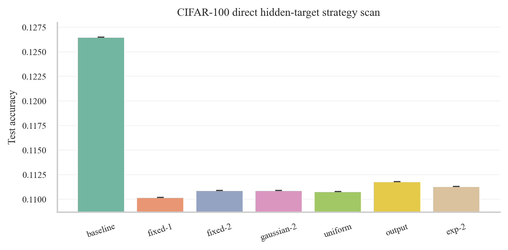
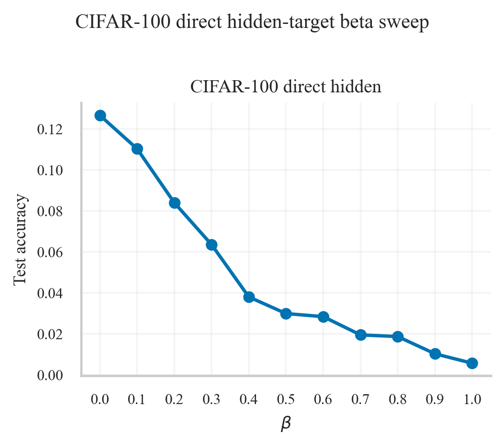

# Greedy Auxiliary Loss

This repository studies layerwise auxiliary losses in which each hidden layer is trained to match a summary of later representations. Earlier runs in the repository explored projected downstream targets and, in some settings, found small gains. The latest follow-up tested a stricter version of the idea on CIFAR-100: hidden states only, no logits, no random projections, direct coordinate-wise MSE between same-width hidden states, `detach_target=True`, and a `beta` definition based on auxiliary gradient share rather than a raw loss coefficient.

That stricter hidden-only variant is clearly counterproductive on CIFAR-100. The beta behavior is now well behaved, in the sense that performance changes smoothly as `beta` increases instead of staying almost flat until collapse at `1.0`, but every positive `beta` hurts accuracy. On the full-data 4-layer ViT follow-up, the baseline reached `0.1265` test accuracy for seed 0 and `0.1227` for seed 1, while the best positive setting, `beta=0.1`, reached only `0.1102` and `0.1061`. The 2-seed means are therefore `0.1246` for the baseline versus `0.1082` for the best positive auxiliary setting. Larger `beta` values degrade smoothly toward chance.

The conclusion for the current version of the method is therefore negative: once logits and random projections are removed and the auxiliary loss is imposed directly on hidden coordinates with detached targets, the method does not help on CIFAR-100 and is better understood as a controlled failure case than as a promising recipe.

The full summary for this follow-up is in [reports/cifar100_direct_hidden_note.md](reports/cifar100_direct_hidden_note.md), and the broader project report remains in [reports/experiment_report.md](reports/experiment_report.md).
