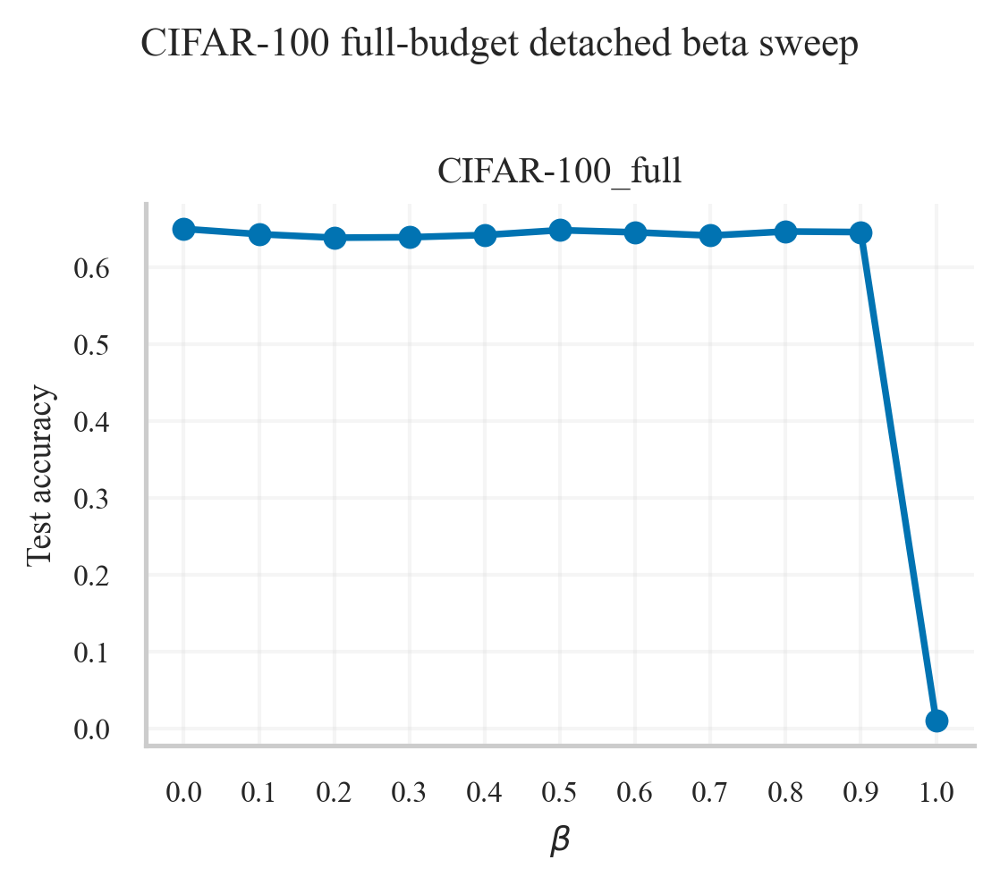

# Greedy Auxiliary Loss

This repository studies a layerwise auxiliary objective in which each hidden layer predicts a summary of later representations. The original pilot work used detached downstream targets and showed small but consistent gains on MNIST, a tiny CIFAR-100 ViT pilot, AG News, and DBPedia 14. The main lesson from the later full-budget CIFAR-100 rerun is that the detach choice is not universal: on a pretrained ResNet18 trained on the full CIFAR-100 training set, the best variant was an output-only auxiliary loss with **no detach** and `beta=0.5`.

The pilot transfer study still matters because it shows the idea is portable. The best observed pilot gains were `+0.0019` on MNIST, `+0.0046` on the tiny CIFAR-100 pilot, `+0.0118` on AG News, and `+0.0073` on DBPedia 14. But the stronger CIFAR rerun is the better indicator of what survives a credible baseline: the full-budget baseline reached `0.6487` mean test accuracy over two seeds, and the best confirmed auxiliary variant improved that to `0.6542`.

A later targeted follow-up tested a stricter hidden-only variant on CIFAR-100: no logits, no random projections, direct coordinate-wise MSE between same-width hidden states, `detach_target=True`, and a new `beta` interpretation where `beta` controls the auxiliary share of the update through gradient-share normalization. That study produced a meaningful, non-flat beta sweep, but it did not beat the same ViT baseline. The best positive setting was `beta=0.1` with `0.1102` test accuracy versus a `0.1265` baseline. The dedicated summary is in [reports/cifar100_direct_hidden_note.md](reports/cifar100_direct_hidden_note.md).

The short version is that the idea looks promising, but the method is more conditional than the initial pilot suggested. Detached targets are still a good default for small from-scratch runs, while stronger or pretrained backbones may prefer non-detached, output-focused targets with a larger mixing coefficient. The full write-up, figures, and run metadata are in [reports/experiment_report.md](reports/experiment_report.md).
