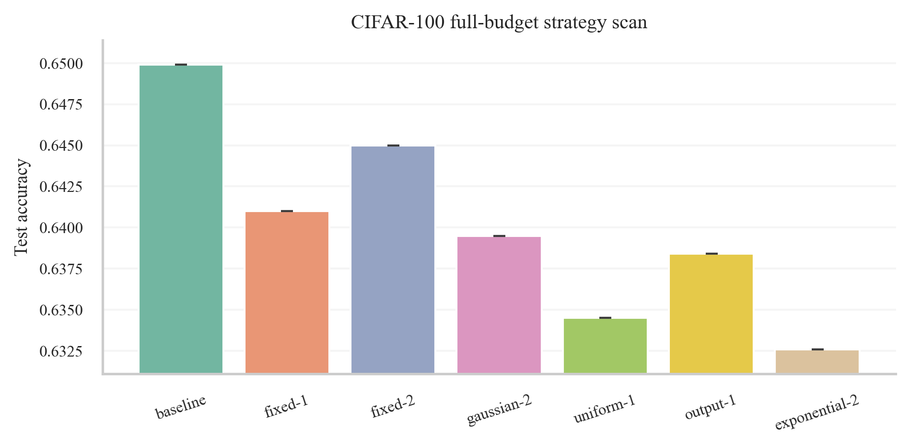
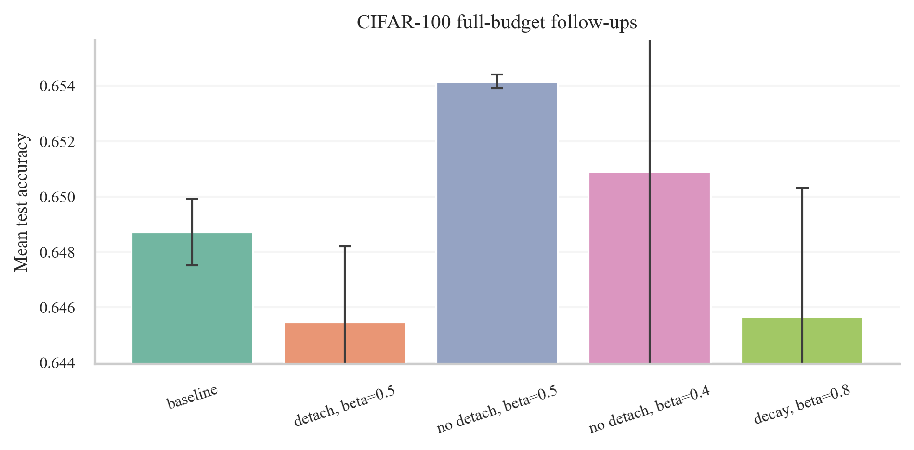

# Experiment Report

## Question

This project studies a simple layerwise auxiliary objective. Each hidden layer predicts a summary of later representations, and that auxiliary loss is mixed with the primary task loss. The original hypothesis was that detached downstream targets would provide a stable local signal. After the full-budget CIFAR-100 rerun, the question became slightly sharper: which target construction and gradient-flow regime actually helps once the baseline is no longer toy-sized?

## Method

Let $h_i$ be the representation at layer $i$. For each hidden layer, the model learns a predictor $p_i(h_i)$ and matches it to a weighted combination of future representations projected into a common target space. The combined objective is

$$L = (1-\beta)L_{primary} + \beta L_{aux}.$$

The future target uses fixed random projections of downstream hidden states and optionally the logits. I tested fixed lookahead, Gaussian weighting, uniform averaging, output-only targets, and exponential weighting. I also tested detached and non-detached targets, constant and decayed $\beta$, and a shallow-only auxiliary variant that skips the deepest hidden layers.

## Experimental protocol

The study proceeded in two phases. First, I ran a pilot transfer study: Stage 1 selected the basic target-construction rule on MNIST, Stage 2 swept $\beta$ on MNIST and on a tiny CIFAR-100 ViT pilot, and the positive pilot result triggered AG News and DBPedia 14 follow-ups. Second, I reran CIFAR-100 properly on full data with a pretrained ResNet18, standard augmentation, cosine decay, and two seeds. On that stronger recipe I repeated the strategy search, the detached $\beta$ sweep, and then a set of targeted follow-ups motivated by the observed failure modes.

## Stage 1: selecting the pilot variant

On MNIST, the best validation result came from a detached Gaussian future-target kernel centered two layers ahead with standard deviation 1.0. Gradient normalization was clearly harmful. The normalization variant dropped MNIST validation accuracy to 0.9457, far below the non-normalized counterpart at 0.9759.

## Pilot transfer results

The pilot study established that the idea was not confined to MNIST. Detached targets improved the best observed test accuracy on the MNIST pilot, the lightweight CIFAR-100 pilot, AG News, and DBPedia 14.

| Dataset | Model | Budget | Best auxiliary | Baseline | Auxiliary | Gain |
| --- | --- | --- | --- | --- | --- | --- |
| MNIST | 4-layer MLP | 8 epochs, full train/test | detached Gaussian, beta=0.8 | 0.9774 | 0.9793 | 0.0019 |
| CIFAR-100 pilot | ViT (4 layers, patch 8) | 4 epochs, 10% train, full val/test | detached Gaussian, beta=0.1 | 0.0638 | 0.0684 | 0.0046 |
| AG News | 4-layer text transformer | 3 epochs, 5% train, 50% val/test | detached Gaussian, beta=0.2 | 0.7271 | 0.7389 | 0.0118 |
| DBPedia 14 | 4-layer text transformer | 2 epochs, 2% train, 10% val/test | detached Gaussian, beta=0.2 | 0.8647 | 0.8720 | 0.0073 |
| CIFAR-100 full-budget | pretrained ResNet18 | 2 epochs, full train/test, 2 seeds | output target, no detach, beta=0.5 | 0.6487 | 0.6542 | 0.0055 |

## Full-budget CIFAR-100 rerun

The full-budget CIFAR rerun materially changed the picture. The upgraded baseline, a pretrained ResNet18 fine-tuned on the full training set for two epochs, reached a mean test accuracy of 0.6487 over two seeds. That already resolves the earlier “why is CIFAR so low?” problem: the weak 6.8% result was a deliberately tiny pilot, not a realistic CIFAR recipe.

Within the detached strategy scan at $\beta=0.2$, the validation winner was the output-only target, while the best single-seed test score among the detached strategies came from fixed lookahead 2. More importantly, the detached constant-$\beta$ sweep did not beat the full-budget baseline robustly. A matched two-seed comparison at $\beta=0.5$ gave 0.6454 for the detached output-target variant, which is below the baseline at 0.6487.

The most informative follow-up was to remove the detach. On the same full-budget CIFAR recipe, the output-target auxiliary loss with no detach and $\beta=0.5$ reached 0.6542 mean test accuracy over two seeds, a gain of 0.0055 over the baseline and 0.0087 over the matched detached variant. A nearby no-detach setting at $\beta=0.4$ also improved over baseline, but less strongly. In contrast, a linearly decayed $\beta=0.8$ schedule and the shallow-only auxiliary variants did not produce a robust win.

## Interpretation

The evidence now supports a more nuanced conclusion than the original pilot. Detached targets are a good default in the small from-scratch regime and transferred well in the pilot study, but they are not universally optimal. On the strongest recipe in this project, the promising variant was actually non-detached and output-focused. A plausible interpretation is that once the baseline representation is already strong, letting the downstream representation move with the auxiliary objective can reduce target mismatch and make the auxiliary loss act more like a coordinated shaping signal than a frozen self-distillation target.

The other clear pattern is that the primary-loss anchor remains essential. At $\beta = 1.0$, the CIFAR-100 model collapsed to chance-level classification performance, which confirms that the auxiliary objective alone does not solve the task.

## Hyperparameter heuristics

Four practical heuristics emerged.

1. Detached targets remain a sensible default for small from-scratch pilots, but do not assume that detach is optimal once the backbone is stronger or pretrained. On full-budget CIFAR-100, the best result came from the non-detached output-target variant.
2. For detached pilots, start in the moderate range $\beta \in [0.1, 0.2]$. For the stronger CIFAR recipe here, the best no-detach result landed higher, at $\beta=0.5$, which suggests that the right $\beta$ depends strongly on how aligned the auxiliary target is with the task.
3. Output-only targets deserve serious consideration on classification problems. In the full-budget CIFAR rerun they dominated the detached validation scan and underpinned the best non-detached result.
4. Scheduling or shallow-only application are reasonable rescue ideas when the auxiliary loss looks too constraining, but in this study neither beat the matched non-detached output-target variant.

## Limitations

The transfer study outside CIFAR still uses fixed-budget pilots, and the full-budget CIFAR rerun is only two epochs because the machine is CPU-only. The detached strategy scan on full-budget CIFAR used one seed, and only the most promising follow-up variants were confirmed across two seeds. I would not yet claim a universal rule that non-detached targets are better; I would claim that the detach choice is regime-dependent and must be treated as a first-class experimental variable.

## Conclusion

The project now supports two defensible conclusions. First, the auxiliary-loss idea is real enough to survive beyond MNIST: it helped on the original pilot transfer study and, after a proper rerun, it can improve full-budget CIFAR-100 as well. Second, the best variant depends on the regime. The strongest result in this repository is not the original detached Gaussian target, but an output-only, non-detached auxiliary loss with $\beta=0.5$ on full-budget CIFAR-100.
