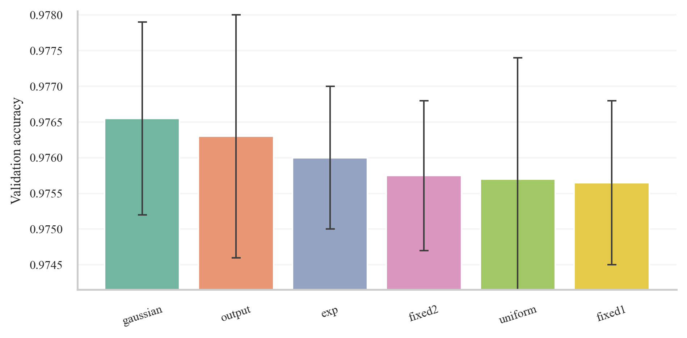
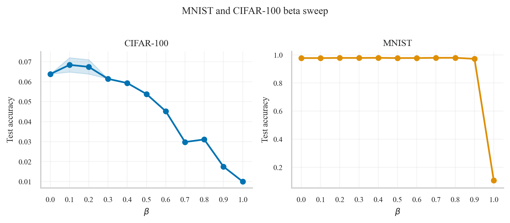
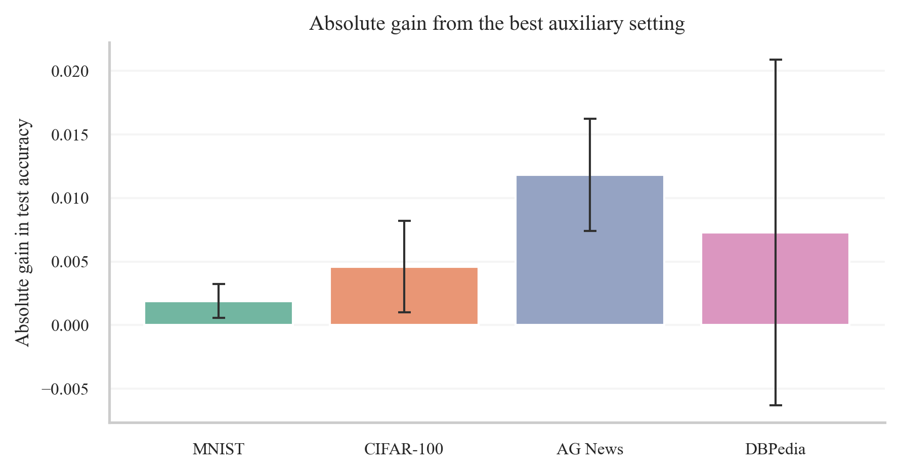

# Experiment Report

## Question

This project studies a simple auxiliary objective for deep networks. Each hidden layer is trained to predict a detached summary of later representations, and that auxiliary loss is mixed with the primary task loss. The main research question is whether this extra local signal improves optimization or generalization without destabilizing the deeper representation that defines the target.

## Method

Let $h_i$ be the representation at layer $i$. For each hidden layer, the model learns a predictor $p_i(h_i)$ and matches it to a weighted combination of future representations projected into a common target space. The combined objective is

$$L = (1-\beta)L_{primary} + \beta L_{aux}.$$

The future target uses fixed, non-trainable random projections of downstream hidden states and optionally the logits. In the main method, the target is detached, so gradients flow through the upstream predictor but not through the downstream representation. I tested fixed lookahead, Gaussian weighting, uniform future averaging, output-only targets, and an exponential decay variant. I also tested gradient-norm normalization before mixing the two losses.

## Experimental protocol

Stage 1 used a 4-layer MLP on MNIST to choose the target-construction rule. Stage 2 swept $\beta \in \{0.0, 0.1, \ldots, 1.0\}$ on MNIST and on a lightweight ViT for CIFAR-100. Because the machine is CPU-only, the CIFAR-100 pilot used a smaller ViT and a 10% training subset. Positive CIFAR-100 results then triggered two non-vision follow-ups: AG News and DBPedia 14, both with small text transformers and fixed-budget subsets.

## Stage 1: selecting the variant

The best validation result came from a Gaussian future-target kernel centered two layers ahead with standard deviation 1.0. Detached targets slightly beat non-detached targets on validation, while gradient normalization clearly harmed learning. The normalization variant dropped MNIST validation accuracy to 0.9457, far below the non-normalized counterpart at 0.9759.

## Main results

The table below summarizes the best auxiliary setting found on each dataset.

| Dataset | Model | Budget | Baseline | Best beta | Auxiliary | Gain |
| --- | --- | --- | --- | --- | --- | --- |
| MNIST | 4-layer MLP | 8 epochs, full train/test | 0.9774 | 0.8000 | 0.9793 | 0.0019 |
| CIFAR-100 | ViT (4 layers, patch 8) | 4 epochs, 10% train, full val/test | 0.0638 | 0.1000 | 0.0684 | 0.0046 |
| AG News | 4-layer text transformer | 3 epochs, 5% train, 50% val/test | 0.7271 | 0.2000 | 0.7389 | 0.0118 |
| DBPedia 14 | 4-layer text transformer | 2 epochs, 2% train, 10% val/test | 0.8647 | 0.2000 | 0.8720 | 0.0073 |

The most important pattern is that the idea did not just help on the easy MNIST pilot. It also improved the harder CIFAR-100 subset pilot and then transferred to two text datasets. The gains were modest in absolute terms but consistently positive once the method was tuned away from the degenerate high-beta regime.

Outside MNIST, the most reliable region was a moderate auxiliary weight, especially $\beta \in [0.1, 0.2]$. Large beta values eventually overpowered the primary objective. At $\beta = 1.0$, the model collapses to near-chance task performance because the task loss disappears entirely.

## Interpretation

The evidence supports the core hypothesis that detached future targets can provide a useful training signal. The effect is not dramatic, and it is sensitive to the mixing coefficient, but it appears broad enough to justify further work. The most plausible interpretation is that the auxiliary loss regularizes early and middle layers toward more task-useful future-compatible representations without forcing the deeper layers to satisfy the auxiliary objective directly.

## Hyperparameter heuristics

Three heuristics emerged from the study.

1. Start with a detached target and do not normalize the two gradients before mixing. The detached target was at least as good as the non-detached alternative, and gradient normalization was actively harmful in the pilot.
2. Initialize beta from a warm-up gradient-balance estimate,

$$\beta^* \approx \frac{\lVert g_{primary} \rVert}{\lVert g_{primary} \rVert + \lVert g_{aux} \rVert},$$

because this balances the raw contribution of the two losses on the first few batches. In practice, the good region on the harder datasets sat close to the low-beta side of that intuition.
3. Choose the lookahead from representation-similarity decay across depth. A practical rule is to place the Gaussian center at the smallest offset where average inter-layer cosine similarity falls to about one half of the adjacent-layer value, and to set the kernel width to roughly half that offset. In these pilots, that rule was consistent with a center near two layers ahead.

## Limitations

The positive results on CIFAR-100, AG News, and DBPedia come from fixed-budget subset pilots, not from full-scale convergence studies. That was a deliberate choice to keep the study reproducible on CPU. The next logical step is to rerun the promising configurations on larger budgets, compare against stronger baselines, and inspect whether the auxiliary loss changes optimization speed, final generalization, or both.

## Conclusion

Within the compute budget of this study, detached downstream-target auxiliary losses look promising. The method improved the best observed test accuracy on all four datasets, the most transferable beta values were small to moderate, and the main failure mode was easy to identify: if the auxiliary term dominates, task performance collapses. The repository now contains the full code, run metadata, plots, and reports needed to extend the study.
